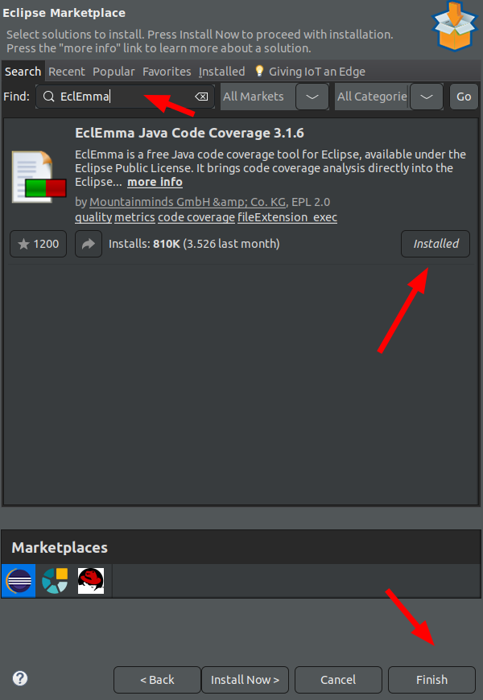

# Biblioteca de Cobertura de Código Java - JaCoCo

# Visão Geral

Cobertura de código é uma métrica de software usada para medir quantas linhas de nosso código são executadas durante testes automatizados.

JaCoCo (Java Code Coverage) é uma biblioteca gratuita de cobertura de código, um gerador de relatórios de cobertura de código para projetos Java.

# Builds de lançamento

As releases builds oficiais estão disponíveis para download [aqui](https://www.eclemma.org/jacoco/index.html). JaCoCo também está disponível no [repositório Maven](https://mvnrepository.com/artifact/org.jacoco/jacoco-maven-plugin).

# Java Code Coverage for Eclipse

## Instalação

O EclEmma é fornecido como um pequeno conjunto de plug-ins do Eclipse sob a Licença Pública do Eclipse. Como para todos os plug-ins padrão do Eclipse, existem diferentes opções de instalação. Usar o `marketplace` ou site de atualização é o procedimento recomendado.

## Pré-requisitos

EclEmma requer Eclipse 3.8 ou `superior` e Java 1.5 ou `superior`. Ele não tem dependências em um sistema operacional específico. É claro que sua instalação do Eclipse precisa conter as ferramentas de desenvolvimento Java (JDT) que estão incluídas na instalação padrão do SDK.

Desde o Eclipse 3.6, o Eclipse Marketplace Client permite a instalação direta do EclEmma de dentro do Eclipse. Siga as etapas abaixo.

1. No menu do Eclipse, selecione Ajuda → Eclipse Marketplace

<p align="center">
  
</p>

2. Procure por "EclEmma"

<p align="center">
  
</p>

3. Clique em Instalar para a entrada "EclEmma Java Code Coverage"
4. Siga as etapas do assistente de instalação.

O EclEmma registra quais partes do seu código Java são executadas durante o lançamento de um programa específico. Essa técnica é chamada de análise de cobertura de código e normalmente é usada com testes automatizados, como testes de unidade JUnit. Ajuda a identificar partes não testadas de uma base de código e melhorar os testes correspondentes.

Executar uma análise de cobertura é tão simples quanto pressionar um único botão, como os botões Executar e Depurar existentes . Os resultados da cobertura são resumidos automaticamente na visualização Cobertura e destacados nos editores Java. Abaixo, exemplo do plug-in para eclipse:

Clicar com o botão direito do mouse e ir `Coverage As -> 2Junit Test`;

<p align="center">
  
</p>

Os testes serão executados e o resultado será exibido na própria IDE.

Ao clicar na classe (dentro do relatório) é possível ver onde o teste não passou.

<p align="center">
  
</p>

Para verificar a documentação, [verifique aqui](https://www.eclemma.org/userdoc/index.html).

# Configuração do Maven

Para começar a usar o JaCoCo, precisamos declarar este [plugin maven](https://mvnrepository.com/artifact/org.jacoco/jacoco-maven-plugin) em nosso arquivo pom.xm:

## Properties
```xml
<!-- Java Code Coverage Library -->
<jacoco-maven-plugin.version>0.8.8</jacoco-maven-plugin.version>
```
## Plugin
```xml
<plugin>
   <groupId>org.jacoco</groupId>
   <artifactId>jacoco-maven-plugin</artifactId>
   <version>${jacoco-maven-plugin.version}</version>
   <executions>
      <execution>
         <goals>
            <goal>prepare-agent</goal>
         </goals>
      </execution>
      <execution>
         <id>report</id>
         <phase>prepare-package</phase>
         <goals>
            <goal>report</goal>
         </goals>
      </execution>
   </executions>
</plugin>
```
A execução do teste usando JUnit acionará automaticamente o agente JaCoCo. Ele criará um relatório de cobertura em formato binário no diretório de destino, `target/jacoco.exec`.

Obviamente, não podemos interpretar a saída sozinho, mas outras ferramentas e plugins podem, por exemplo, `Sonar Qube`.

A boa notícia é que podemos usar o goal `jacoco:report` para gerar relatórios de cobertura de código legíveis em vários formatos, como HTML, CSV e XML.

Por exemplo, agora podemos dar uma olhada na página `target/site/jacoco/index.html` para ver como é o relatório gerado:

Executando o comando: `mvn clean package jacoco:report`

<p align="center">
  
</p>

Dentro do target da aplicação (**target/site/jacoco/index.html**) o resultado da cobertura dos testes.

<p align="center">
  
</p>

# Verificação de pontuação de cobertura

Em um projeto do mundo real, à medida que os desenvolvimentos avançam, precisamos acompanhar a pontuação de cobertura do código.

JaCoCo oferece uma maneira simples de declarar os **requisitos mínimos** que devem ser atendidos, caso contrário a compilação falhará.

Podemos fazer isso adicionando o seguinte objetivo de verificação em nosso arquivo pom.xml:

## Property
```xml
<code.coverage.ratio>0.99</code.coverage.ratio>
```
## Plugin
```xml
<plugin>
   <groupId>org.jacoco</groupId>
   <artifactId>jacoco-maven-plugin</artifactId>
   <version>${jacoco-maven-plugin.version}</version>
   <executions>
      <execution>
         <goals>
            <goal>prepare-agent</goal>
         </goals>
      </execution>
      <execution>
         <id>report</id>
         <phase>prepare-package</phase>
         <goals>
            <goal>report</goal>
         </goals>
      </execution>
      <execution>
         <id>jacoco-check</id>
         <goals>
            <goal>check</goal>
         </goals>
         <configuration>
            <rules>
               <rule>
                  <element>PACKAGE</element>
                  <limits>
                     <limit>
                        <counter>LINE</counter>
                        <value>COVEREDRATIO</value>
                        <minimum>${code.coverage.ratio}</minimum>
                     </limit>
                  </limits>
               </rule>
            </rules>
         </configuration>
      </execution>
   </executions>
</plugin>
```
Como podemos ver, estamos limitando a pontuação mínima para cobertura de linhas a 99%.

Com o goal `verify` podemos executar o comando Maven `mvn clean verify` para verificar se as regras são respeitadas ou não. Os logs mostraram algo como:

<p align="center">
  
</p>

Diminuindo a cobertura de linhas para 30%, a aplicação será compilada.

<p align="center">
  
</p>


# Observação sobre a cobertura mínima

O ideal é que você suba o mínimo de cobertura aos poucos até um número aceitável. É muito difícil uma aplicação ser 100% coberta, mas tente chegar em um patamar alto.

# Excluindo pacotes

Para excluir um pacote, ou classe, seguir o exemplo abaixo:

<p align="center">
  
</p>

Atualmente a aplicação não testa a classe Application.class, apenas o contexto do spring, então podemos tirar essa classe da cobertura de código.
```xml
<plugin>
   <groupId>org.jacoco</groupId>
   <artifactId>jacoco-maven-plugin</artifactId>
   <version>${jacoco-maven-plugin.version}</version>
   <executions>
      <execution>
         <goals>
            <goal>prepare-agent</goal>
         </goals>
      </execution>
      <execution>
         <id>report</id>
         <phase>prepare-package</phase>
         <goals>
            <goal>report</goal>
         </goals>
      </execution>
      <execution>
         <id>jacoco-check</id>
         <goals>
            <goal>check</goal>
         </goals>
         <configuration>
            <excludes>
               <exclude>com/example/jacoco/Application*.class</exclude>
            </excludes>
            <rules>
               <rule>
                  <element>PACKAGE</element>
                  <limits>
                     <limit>
                        <counter>LINE</counter>
                        <value>COVEREDRATIO</value>
                        <minimum>${code.coverage.ratio}</minimum>
                     </limit>
                  </limits>
               </rule>
            </rules>
         </configuration>
      </execution>
   </executions>
</plugin>
```

Agora, a aplicação consegue atingir a mínimo de cobertura:

<p align="center">
  
</p>

Use com moderação essa exclusão. Verifique se realmente o pacote, ou classe, precisam realmente não ser testados.

# Projeto de Exemplo

Para verificar a aplicação de exemplo, acesse o repositório [aqui](). Caso queira rodar o projeto, execute  `./mvnw spring-boot:run`.
